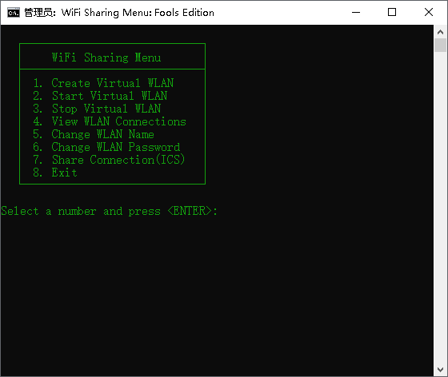

wifi
====

A batch tools for Windows, Create virtual WIFI hotspot(WIFI AP), start, stop WIFI, which make the laptop become a AP sharing with mobile device

这是一个利用系统的WIFI承载网络功能来建立虚拟AP的批处理工具，无需第三方的软件支持，你就可以把你的笔记本变成一个WIFI路由器。你可以创建WIFI热点，启动、停止WIFI热点、修改密码。批处理会自动判断你的电脑是否支持承载网络。



For Windows 10 or higher
===
M$ already remove hostednetwork from Windows 10 or higher version, So the batch not working any longer in Win10 or higher.
You can use the wifi.ps1(Powershell script) instead of it.
Usage:
```
powershell -file wifi1.ps1 AP_Name AP_Password
```
